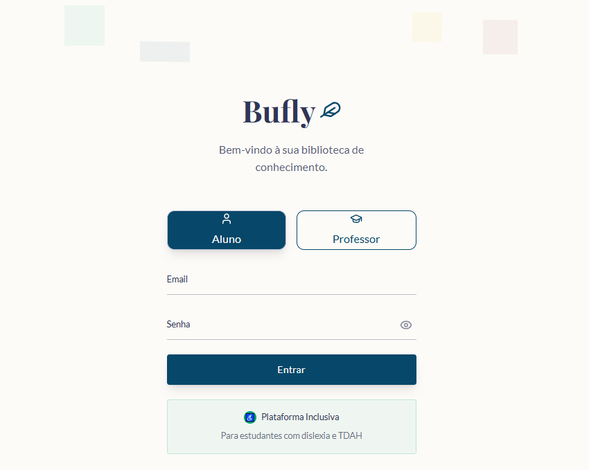
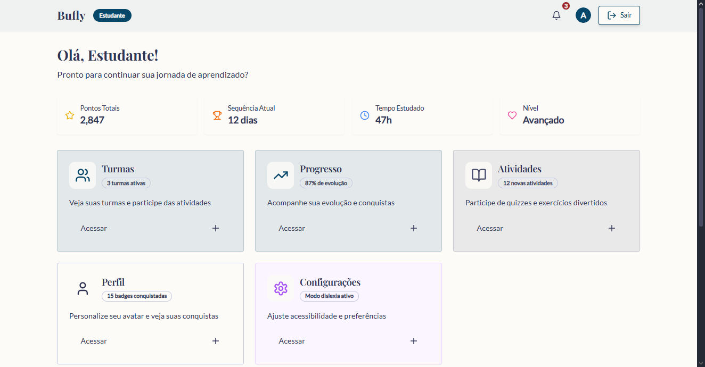
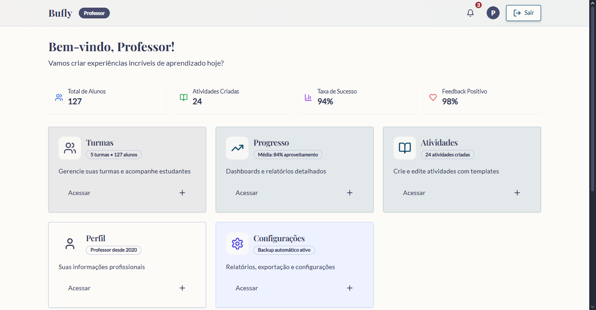

# BUFLY – Projeto Educacional Inclusivo

## 📌 Sobre o Projeto
O **BUFLY** é uma plataforma educacional inclusiva em desenvolvimento, voltada para alunos e professores, com foco em **gamificação, acessibilidade** e **design criativo**.  
Atualmente o projeto encontra-se em **fase inicial** e funciona apenas como **front-end** (sem conexões exatas com o backend).  

O **Lovable** é crucial nesta etapa porque:  
- Permite que possamos criar e ajustar o **design** com rapidez.  
- Facilita a **portabilidade** do projeto para diferentes ambientes.  
- Ajuda a estruturar os fluxos de navegação de forma clara e visual.

---

## 🚪 Como importar e rodar o projeto

### 1. Clonar o repositório

```sh
git clone <SEU_GIT_URL>
cd <NOME_DO_PROJETO>
````

### 2. Instalar dependências

```sh
npm install
```

### 3. Rodar em ambiente local

```sh
npm run dev
```

Após esse passo, o servidor local será iniciado e será possível visualizar o projeto no navegador.

---

## 🖼️ Telas atuais (em desenvolvimento)

### Tela de Login

*Espaço para imagem da tela de login (email e senha).*


### Main – Aluno

*Espaço para imagem da tela principal do aluno (Turmas, Progresso, Atividades, Perfil, Configurações).*


### Main – Professor

*Espaço para imagem da tela principal do professor (Gerenciar Turmas, Criar Atividades, Relatórios, Perfil, Configurações).*


---

## 🎯 Metas e mudanças esperadas

* **Acessibilidade avançada**:
  Inclusão de fontes adaptáveis (ex.: Lexend, OpenDyslexic), suporte a contraste e leitores de tela.

* **Design moderno e criativo**:
  Inspirado em uma **biblioteca grega** (sabedoria, estrutura) e em **jardins da Finlândia** (leveza, harmonia).

* **Fluxo de usuários claro**:

  * **Aluno** → acesso rápido às atividades e progresso.
  * **Professor** → criação de atividades, gestão de turmas e análise de relatórios.

* **Gamificação**:
  Feedback instantâneo, pontos, ranking e relatórios detalhados.

* **Página inicial (landing page)**:
  Explicar o que é a plataforma, como funciona e apresentar depoimentos.

* **Integrações futuras**:

  * **APIs de acessibilidade**: leitores de tela, tradução, reconhecimento de voz.
  * **APIs de IA**: geração automática de quizzes, feedback inteligente e relatórios.

---

## 🛠️ Tecnologias utilizadas

* Vite
* TypeScript
* React
* shadcn-ui
* Tailwind CSS

---

📍 **Status atual**: Projeto em **fase de desenvolvimento inicial**.
👉 Funciona apenas como **front-end** (protótipo de telas), sem integrações completas com o backend.


#
